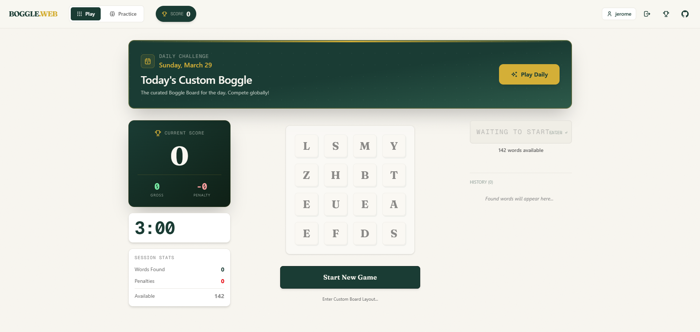

# 🎨 Creative Ideas for Boggle-NYT

Here are some creative directions to take the project, ranging from gameplay mechanics to visual polish.

## Big changes

Overall, there are a few parts of this project that could be improved. To begin with, login is currently handled by Supabase. THis is fine for a small project, but the website is starting to gain visibility and more and more users are signing up. This means that the limited email flow is a big problem. Some alternative must be explored to create consistent Logins. I've created an audit of the project as a whole at C:\Users\jerome\.gemini\antigravity\brain\38663409-bfb1-4e80-812b-914c794051c5\project_audit.md.resolved, but please create some implementation plan for the following features, as well as any vulnerabilities and features in the Audit file. 

1. Logins should be handled better, and there should be a "Forgot Username / Password?" section that sends an email directly to the logged in email. This is important. WE may need to find an alternative to Supabase if necessary -- don't be afraid of that.
2. There should be different options entirely when selecting "Start New Game". It should open up a popup selecting the TYPE OF GAME -- I trust the implementation up to you but to keep the aesthetics of the website the same. Do take a look at Agent.md for the general practices of this project. Type of games can be found at C:\Users\jerome\Desktop\Projects\Boggle-nyt\boggle-NYT\CREATIVE_IDEAS.md
3. BUgs found in Project Audit
4. Currently, the leaderboard resets at a different time from the actual Daily board. Needs investigation.
5. Start New Game should have a Classic mode with 3 options : Open, Closed, or Random that create boards with certain counts.

## 🕹️ Gameplay Variants

### 1. **Blitz Mode (Time Attack)**

- **Concept**: Start with 60 seconds. Every word found adds time (e.g., +2s for 3 letters, +5s for 6 letters).
- **Goal**: Survive as long as possible. High intensity.

### 2. **"Big Boggle" (5x5)**

- **Concept**: Classic 5x5 grid support.
- **Why**: Allows for much longer words and higher scores.
- **Implementation**: Toggle switch in settings to change grid size.

### 3. **The "Golden Tile"**

- **Concept**: One tile on the board is gold. Using it in a word applies a 2x or 3x multiplier to that word's score.
- **Strategy**: Forces players to build words around specific locations.

## 💅 Visual & Immersion

### 4. **3D Dice Rolling Physics**

- **Concept**: Instead of letters just appearing, simulate 16 3D dice falling and settling into the grid.
- **Tech**: React Three Fiber + Cannon.js.
- **Vibe**: Visually stunning and "tactile".

### 5. **Interactive Sound Design**

- **Concept**:
  - *Click*: Satisfying mechanical keyboard or wooden tile clack.
  - *Submit*: "Ding" for correct, "Buzz" for wrong.
  - *Timer*: Ticking clock in the last 10 seconds.
- **Tech**: `use-sound`.

### 6. **Drag-to-Select**

- **Concept**: Allow users to click and drag across tiles to form words (like mobile mobile games).
- **UX**: Much faster than clicking individual tiles.

## 🤝 Social & Competitive

### 7. **"Challenge a Friend" (Deep Links)**

- **Concept**: Generate a unique URL (e.g., `boggle.web/challenge?seed=12345`).
- **Flow**: User sends link -> Friend opens it -> Plays same board -> Sees comparison animation at the end.

### 8. **Live Multiplayer (Duel)**

- **Concept**: Real-time 1v1.
- **Twist**: Words found by Player A are "stolen" or "locked" for Player B.

## 🧠 Analytics & Progression

### 9. **"Missed Opportunities" Heatmap**

- **Concept**: visual overlay on the results board showing:
  - Which tiles were part of the best words you missed.
  - "You found 100% of the words in this corner, but 0% in that corner."

### 10. **Word Definitions**

- **Concept**: Click any word in the "Found" or "Missed" list to see its definition.
- **Why**: Enhances the "NYT Educational" vibe.

## 🤖 AI Integration

### 11. **AI "Coach"**

- **Concept**: After a game, the AI highlights a specific pattern you missed (e.g., "front-loading" words or missing easy plurals).

### 12. **Smart Hints**

- **Concept**: During gameplay (maybe with a score penalty), give a semantic hint: "There's an animal name in the top row."
